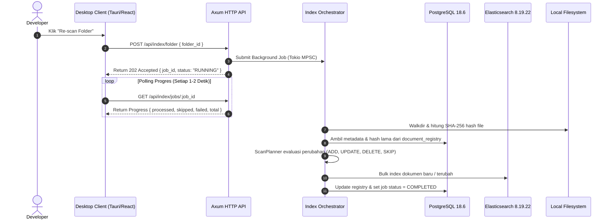

# AGENTS.md — LynxSearch AI Agent Instruction & Development Guardrails

> **Tujuan Dokumen:** Panduan operasional komprehensif, arsitektur, dan guardrails ketat bagi AI Coding Agent (Cursor, Devin, Copilot, Antigravity) saat membaca, merancang, mengimplementasikan, dan menguji kode di repositori **LynxSearch**.  
> **Status Proyek:** Aktif (Fase 0 – 8: Setup, Backend Hexagonal, Storage Adapters, Ingestion Pipeline, Core Search, Desktop UI, Advanced Filters/Facets, Code Search).  
> **Modus Kerja Agent:** *Advisory Roadmap* — Gunakan [TASK.md](file:///mnt/windows/Users/boyblanco/Documents/code/web/Rust_LynxSearch/TASK.md) sebagai panduan alur tahapan kerja; otonom dalam menambahkan crate/utilitas ringan yang relevan tanpa merusak batasan arsitektur inti.

---

## Master Reference Matrix (Dokumen Sumber Kebenaran)

Sebelum memulai tugas apa pun, agent **wajib merujuk ke dokumen spesifikasi resmi** berikut:

| Dokumen | Peran & Sumber Kebenaran | Tautan File |
|---|---|---|
| **PRD** | Kebutuhan produk, user stories (A–K), batasan scope, pemetaan fase 1–8 | [PRD-LynxSearch.md](file:///mnt/windows/Users/boyblanco/Documents/code/web/Rust_LynxSearch/PRD-LynxSearch.md) |
| **Architecture** | Arsitektur Hexagonal, boundary domain, skema PostgreSQL, mapping ES, kontrak API, security | [ARCHITECTURE.md](file:///mnt/windows/Users/boyblanco/Documents/code/web/Rust_LynxSearch/ARCHITECTURE.md) |
| **Design System** | Desain visual OpenAI Dark Minimalist, token Tailwind CSS 4.3, komponen UI, keyboard shortcut | [DESIGN.md](file:///mnt/windows/Users/boyblanco/Documents/code/web/Rust_LynxSearch/DESIGN.md) |
| **Execution Runbook** | Daftar tugas implementasi detail per fase (Fase 0 hingga Fase 8 + Release Gate) | [TASK.md](file:///mnt/windows/Users/boyblanco/Documents/code/web/Rust_LynxSearch/TASK.md) |

---

## 1. Project Overview

- **Nama Proyek:** LynxSearch
- **Deskripsi:** Mesin pencari desktop lokal mandiri berkinerja tinggi untuk *knowledge base* pengembang (catatan Markdown, dokumentasi teknis, konfigurasi, dan *source code*).
- **Fitur Utama:**
  1. **Pencarian Teks Penuh (BM25)**: Perankingan relevansi terbobot (judul > tag > isi).
  2. **Code Search Cerdas**: Mengenali *identifier* `camelCase` dan `snake_case` (misal: `authenticateUser` cocok dengan `authenticate_user`), highlight fragmen dengan nomor baris kode presisi.
  3. **Filter Inline & Facet Sidebar**: Sintaks instan (`language:rust`, `type:code`, `tag:cli`) tersinkronisasi dua arah dengan agregasi kategori.
  4. **Pencarian Toleran & Autocomplete**: Fuzzy matching, prefix search, dan saran kata instan ter-debounce.
  5. **Preview Dokumen Virtual**: Render Markdown GitHub-flavored dan visualisasi kode dengan penomoran baris tanpa lag memori.
  6. **Penyimpanan Hibrida & Inkremental**: File di disk sebagai sumber isi, PostgreSQL untuk metadata & state job, Elasticsearch sebagai indeks pencarian yang *disposable* (dapat dibangun ulang kapan saja).
- **Target Pengguna & Nilai Belajar:** Pengembang perangkat lunak mandiri yang ingin mengelola ribuan berkas lokal sekaligus mendalami Rust, arsitektur *Ports & Adapters*, Elasticsearch tingkat lanjut, dan desktop engineering via Tauri.

### Referensi Detail Dokumen
- Penjelasan Latar Belakang & Problem Statement: [PRD-LynxSearch.md#Problem Statement](file:///mnt/windows/Users/boyblanco/Documents/code/web/Rust_LynxSearch/PRD-LynxSearch.md#L8-L18)
- Deskripsi Solusi Lengkap: [PRD-LynxSearch.md#Solution](file:///mnt/windows/Users/boyblanco/Documents/code/web/Rust_LynxSearch/PRD-LynxSearch.md#L19-L34)
- User Stories (A–K): [PRD-LynxSearch.md#User Stories](file:///mnt/windows/Users/boyblanco/Documents/code/web/Rust_LynxSearch/PRD-LynxSearch.md#L36-L171)
- Visi Arsitektur: [ARCHITECTURE.md#1. Ringkasan Eksekutif & Prinsip Desain](file:///mnt/windows/Users/boyblanco/Documents/code/web/Rust_LynxSearch/ARCHITECTURE.md#L90-L104)

---

## 2. Tech Stack

Semua dependensi dan versi harus mengacu pada spesifikasi resmi berikut:

### 2.1 Backend (Rust Native Service)
- **Rust Compiler:** Version 1.98.1 (Edition 2024).
- **HTTP Framework & Middleware:** [axum](file:///mnt/windows/Users/boyblanco/Documents/code/web/Rust_LynxSearch/ARCHITECTURE.md#L40) 0.8, `tower`, `tower-http` (TraceLayer, CORS, Timeout, Compression).
- **Search Client:** Official Rust crate `elasticsearch = "8.19"` (Menghubungkan ke Elasticsearch server 8.19.22; **Dilarang** menggunakan client v9.x).
- **Async Runtime:** `tokio` 1.x (multi-thread, bounded MPSC channel worker), `tokio-util` (CancellationToken), `async-trait`.
- **Database Driver:** `sqlx` 0.8.x (PostgreSQL driver dengan async pool, compile-time query check, migrasi embedded).
- **File Parsing & Ingestion:** `ignore` (traversal menghormati `.gitignore`), `infer` (magic number binary detection), `encoding_rs` (fallback UTF-8 non-destructive), `pulldown-cmark` (Markdown parser), `serde_yaml` (front-matter metadata parser).
- **Security & Hashing:** `sha2` & `hex` (SHA-256 content hashing), `uuid` (v5 deterministik berdasarkan folder+path, v4 untuk job).
- **Observability:** `tracing`, `tracing-subscriber` (JSON/Pretty env logger), `tracing-appender` (rolling 7-day log), `thiserror` (hierarki error terstruktur).

### 2.2 Frontend (Tauri Desktop Application)
- **Desktop Runtime:** Tauri 2.12 Host (`@tauri-apps/api`, `@tauri-apps/plugin-dialog`, `@tauri-apps/plugin-shell`, `@tauri-apps/plugin-opener`, `@tauri-apps/plugin-window-state`, `@tauri-apps/plugin-single-instance`, `@tauri-apps/plugin-clipboard-manager`).
- **Core UI:** React 19.3, TypeScript 5.8+, Vite 8.1.
- **Styling & Components:** Tailwind CSS 4.3 (menggunakan `@theme` token & CSS variables), `shadcn/ui` (Radix UI primitives), `lucide-react`, `sonner`.
- **State & Data Fetching:** TanStack Query v5 (server cache & polling progress job), Zustand 5 (UI state lokal), `@tanstack/react-virtual` (virtualisasi baris kode).
- **Syntax Highlighting & Markdown:** `react-markdown` 10.x, `Shiki` (syntax highlight presisi dengan nomor baris).
- **OS & Window Integration Guardrails:**
  - *GTK File Dialog Geometry & Parenting:* Auto-clamp `org.gtk.Settings.FileChooser window-size` ke `(900, 560)` dan wajib kaitkan parent window via `builder.set_parent(&window)` agar dialog berstatus modal transient dan tidak pernah muncul tertutup di belakang window utama. Ketika dialog dibatalkan oleh pengguna, bridge mengembalikan `null` langsung tanpa memicu dialog kedua.
  - *Window Stacking & Tiling Manager:* Enforce `set_always_on_top(false)` di runtime backend dan pastikan ekstensi tiling GNOME (seperti Forge) menonaktifkan `float-always-on-top-enabled` agar window dapat ditutup/ditumpuk secara wajar oleh aplikasi lain (IDE, Terminal, dll.). Gunakan native command `focus_window` (`unminimize` + `set_focus` saja) dengan permission `core:window:allow-set-focus`. DILARANG memicu RPC mutasi window (`maximize_window`, `focus_window`) di root evaluation JS (`main.tsx`) atau spam listener `mousedown` global, karena memicu race condition pada Clutter actor saat siklus paint Wayland. Biarkan `tauri-plugin-window-state` menangani restorasi geometri secara aman.
  - *Gesture Zoom Blocking:* Intersepsi dan buang event `gdk::EventType::TouchpadPinch` pada level widget GTK via `webview.connect_event` (`glib::Propagation::Stop`) serta pasang `connect_zoom_level_notify` guard; sediakan keyboard zoom terkontrol via native command `set_desktop_zoom` (`Ctrl +`, `Ctrl -`, `Ctrl 0`).
- **PWA & Mobile Companion Guardrails:**
  - *Dual-Runtime Isolation:* Frontend berbagi satu basis kode React 19 antara desktop Tauri dan PWA mobile. Seluruh pemanggilan fungsi OS native WAJIB diisolasi di balik guard `isTauriEnvironment()` di [desktop-bridge.ts](file:///mnt/windows/Users/boyblanco/Documents/code/web/Rust_LynxSearch/apps/desktop/src/lib/desktop-bridge.ts). Di lingkungan PWA mobile, pemilih folder OS dan aksi open-in-editor didegradasi secara anggun (*graceful notice/disabled*), sedangkan fungsi salin clipboard menggunakan Web Clipboard API (`navigator.clipboard.writeText`).
  - *Bundle Budget Gate Preservation:* Penambahan plugin `vite-plugin-pwa` dan runtime Workbox DILARANG melanggar batas ukuran bundle gzip frontend (`scripts/bundle-budget-checker.py --max-js 450 --max-css 50`). Seluruh route `/api/*` wajib berstrategi `NetworkOnly` (dilarang meng-cache data pencarian ke service worker).
  - *Responsive Single-Pane Standard:* Pada layar mobile (`viewport < 768px`), layout 3-pane diubah menjadi alur satu kolom (single-pane search + full-screen preview slide dengan tombol kembali) dan filter facet dipindahkan ke bottom drawer/sheet dengan touch target minimal 44px x 44px (WCAG 2.5.5).
  - *Dynamic Backend URL:* Client API mengevaluasi URL host backend dinamis dari `localStorage.getItem('LYNX_BACKEND_URL')` sebelum fallback ke origin saat ini atau `VITE_BACKEND_URL`.

### 2.3 Data Store & Infrastruktur (Docker Compose)
- **PostgreSQL:** 18.6-alpine (Container: `lynx_postgres`, port default `127.0.0.1:5432`).
- **Elasticsearch:** 8.19.22 (Container: `lynx_elasticsearch`, port default `127.0.0.1:9200`, heap memory dibatasi ketat `-Xms512m -Xmx512m`).

### Referensi Detail Dokumen
- Hierarki Tech Stack Lengkap: [ARCHITECTURE.md#Tech Stack Hierarchy](file:///mnt/windows/Users/boyblanco/Documents/code/web/Rust_LynxSearch/ARCHITECTURE.md#L11-L86)
- Blueprint Resmi Docker Compose: [ARCHITECTURE.md#1.3 Blueprint Resmi Docker Compose](file:///mnt/windows/Users/boyblanco/Documents/code/web/Rust_LynxSearch/ARCHITECTURE.md#L150-L205)
- Resolusi Versi Elasticsearch Client 8.x: [TASK.md#1.2 Resolusi konflik Elasticsearch client/server](file:///mnt/windows/Users/boyblanco/Documents/code/web/Rust_LynxSearch/TASK.md#L61-L74)

---

## 3. Architecture Rules & Boundaries

LynxSearch menerapkan **Clean Hexagonal Architecture (Ports and Adapters)** secara ketat.

```text
       ┌────────────────────────────────────────────────────────┐
       │                       API Layer                        │
       │           (Axum 0.8 Handlers, DTOs, Routing)           │
       └───────────────────────────┬────────────────────────────┘
                                   │
                                   ▼
       ┌────────────────────────────────────────────────────────┐
       │                   Application Layer                    │
       │    (Use Cases, Commands, Queries, Index Orchestrator)   │
       └──────────────┬──────────────────────────┬──────────────┘
                      │                          │
                      ▼                          ▼
       ┌───────────────────────────┐ ┌──────────────────────────┐
       │       Domain Layer        │ │       Output Ports       │
       │ (Entities, Value Objects, │ │ (Traits: SearchRepo,     │
       │  ScanPlanner, Extractor)  │ │  MetadataRepo, FsDriver) │
       └───────────────────────────┘ └───────────▲──────────────┘
                                                 │ Implements
       ┌─────────────────────────────────────────┴──────────────┐
       │                  Infrastructure Layer                  │
       │     (SQLx Postgres, Elasticsearch 8.x, WalkDir)        │
       └────────────────────────────────────────────────────────┘
```

### 3.1 Aturan Batas Lapisan (Strict Layer Isolation)
1. **Domain Layer (`crates/backend/src/domain/`)**:
   - Berisi entitas murni, value objects, dan modul logika bebas I/O ([QueryParser](file:///mnt/windows/Users/boyblanco/Documents/code/web/Rust_LynxSearch/ARCHITECTURE.md#L400), [DocumentExtractor](file:///mnt/windows/Users/boyblanco/Documents/code/web/Rust_LynxSearch/ARCHITECTURE.md#L440), [ScanPlanner](file:///mnt/windows/Users/boyblanco/Documents/code/web/Rust_LynxSearch/ARCHITECTURE.md#L480), [SearchQueryBuilder](file:///mnt/windows/Users/boyblanco/Documents/code/web/Rust_LynxSearch/ARCHITECTURE.md#L520)).
   - **DILARANG** mengimpor `axum`, `sqlx`, crate `elasticsearch`, atau melakukan interaksi filesystem/jaringan secara langsung.
   - Semua modul domain harus dapat diuji 100% menggunakan pure unit test tanpa mock IO.
2. **Application Layer (`crates/backend/src/application/`)**:
   - Mengorkestrasi use case (Command & Query Separation / CQS), misalnya `IndexOrchestrator`, `SearchService`, `FolderService`.
   - Hanya bergantung pada Domain Layer dan Output Ports (Rust Traits).
3. **Infrastructure Layer (`crates/backend/src/infrastructure/`)**:
   - Mengimplementasikan traits dari output ports: `PgMetadataRepository` (SQLx), `EsSearchRepository` (Elasticsearch), `LocalFileSystemDriver`.
4. **API Layer (`crates/backend/src/api/`)**:
   - Memetakan HTTP request ke DTO tervalidasi, memanggil use case, menangani serialisasi JSON, dan mengubah Domain Error menjadi respons HTTP standar.
5. **Desktop Client & Mobile PWA Companion (`apps/desktop/`)**:
   - **Tauri adalah proses independen.** Backend bukan sidecar tertanam dan tidak di-compile di dalam binary Tauri.
   - Frontend **TIDAK MEMILIKI** logika pencarian, ekstraksi dokumen, perankingan BM25, atau parsing query. Seluruh pemrosesan data dilakukan via HTTP REST ke backend (`127.0.0.1:3001` di desktop, atau host LAN di PWA mobile).
   - Mode PWA di mobile beroperasi sebagai Remote Companion Client untuk mencari, membaca dokumen/kode, dan memicu re-scan; fungsionalitas native desktop Tauri tetap dipertahankan 100% tanpa regresi.

### 3.2 Single Source of Truth
- **Isi Dokumen**: Berkas lokal di disk pengguna adalah satu-satunya sumber kebenaran isi. Isi dokumen **TIDAK** diduplikasi ke PostgreSQL.
- **Metadata, Registry, & Job State**: PostgreSQL adalah sumber kebenaran mutlak untuk data folder, registry dokumen (path, SHA-256 hash, status `INDEXED`/`EXCLUDED`), progres job, dan bobot field.
- **Indeks Pencarian (Elasticsearch)**: Indeks bersifat *disposable* dan dapat dibangun ulang (*rebuilt*) kapan saja secara idempoten dari PostgreSQL + file di disk.

### Referensi Detail Dokumen
- Desain Hexagonal & Prinsip SOLID: [ARCHITECTURE.md#3. Desain Backend: Clean Hexagonal Architecture & Prinsip SOLID](file:///mnt/windows/Users/boyblanco/Documents/code/web/Rust_LynxSearch/ARCHITECTURE.md#L335-L690)
- Prinsip Arsitektur Non-Negosiasi: [TASK.md#0.2 Prinsip arsitektur yang tidak boleh dilanggar](file:///mnt/windows/Users/boyblanco/Documents/code/web/Rust_LynxSearch/TASK.md#L26-L46)
- Diagram Komponen & Batasan Proses: [ARCHITECTURE.md#1.2 Batasan Arsitektural Kunci](file:///mnt/windows/Users/boyblanco/Documents/code/web/Rust_LynxSearch/ARCHITECTURE.md#L95-L146)

---

## 4. Folder Structure Rules

Repositori ini diorganisasi sebagai monorepo modular:

```text
Rust_LynxSearch/
├── AGENTS.md                  # File panduan utama AI Agent (file ini)
├── ARCHITECTURE.md            # Spesifikasi teknis arsitektur lengkap
├── DESIGN.md                  # Spesifikasi UI & token sistem desain
├── PRD-LynxSearch.md          # Dokumen persyaratan produk & user story
├── TASK.md                    # Roadmap eksekusi & runbook teknis bertahap
├── Cargo.toml                 # Cargo Workspace root (backend & internal crates)
├── package.json               # Root scripts untuk tooling monorepo
├── .gitignore                 # Konfigurasi proteksi git (target, node_modules, .env)
├── .env.example               # Template environment aman tanpa kredensial hardcoded
│
├── apps/
│   └── desktop/               # Aplikasi Desktop (Tauri 2.12 + React 19.3)
│       ├── src-tauri/         # Rust native host Tauri, plugin config, capabilities
│       ├── src/
│       │   ├── components/    # Komponen UI (search, results, preview, facets, folders)
│       │   ├── hooks/         # Custom React hooks (keyboard shortcuts, debounce)
│       │   ├── stores/        # Zustand client state (UI, filter selection, preview)
│       │   ├── api/           # TanStack Query hooks & fetch client ke backend Axum
│       │   ├── types/         # TypeScript interface & Zod validation schema
│       │   ├── index.css      # Tailwind CSS 4.3 @theme token setup
│       │   └── main.tsx       # Entry point React
│       ├── vite.config.ts     # Konfigurasi Vite 8.1 & manual code chunking
│       └── package.json       # Frontend dependencies
│
├── crates/
│   └── backend/               # Service Backend Rust (Axum 0.8)
│       ├── Cargo.toml         # Manifest dependency backend
│       ├── migrations/        # SQLx migration files (.sql berurutan)
│       └── src/
│           ├── api/           # HTTP handlers, routes, request/response DTOs
│           ├── application/   # Use cases (IndexOrchestrator, SearchService, CQS)
│           ├── domain/        # Entitas, value objects, ports/traits, pure logic
│           ├── infrastructure/# PostgreSQL adapter, ES adapter, Local FS driver
│           ├── config/        # Environment config loader via dotenvy
│           ├── telemetry/     # Tracing, JSON formatters, rolling file appender
│           ├── error.rs       # Domain error taxonomy (thiserror)
│           └── main.rs        # Bootstrap, listener 127.0.0.1:3001, shutdown drain
│
└── docker/
    └── docker-compose.yml     # PostgreSQL 18.6 + Elasticsearch 8.19.22 orchestrator
```

### Aturan Penempatan Berkas Baru:
- Logika parsing query baru / token baru -> Letakkan di `crates/backend/src/domain/query_parser/`.
- Rule ekstraksi format dokumen baru -> Letakkan di `crates/backend/src/domain/document_extractor/`.
- Adapter penyimpanan baru / query SQL baru -> Letakkan di `crates/backend/src/infrastructure/persistence/`.
- Komponen tampilan desktop baru -> Letakkan di `apps/desktop/src/components/<feature>/`.
- Script automasi atau utility dev -> Letakkan di `scripts/`.

### Referensi Detail Dokumen
- Topologi Monorepo & Struktur Folder: [ARCHITECTURE.md#2. Struktur Monorepo & Topologi Modul](file:///mnt/windows/Users/boyblanco/Documents/code/web/Rust_LynxSearch/ARCHITECTURE.md#L206-L334)
- Komponen Desktop Detail: [DESIGN.md#5. Anatomi Komponen UI](file:///mnt/windows/Users/boyblanco/Documents/code/web/Rust_LynxSearch/DESIGN.md#L247-L292)

---

## 5. Coding Standards & Conventions

### 5.1 Standar Bahasa Rust
- **Rust Edition:** Wajib menggunakan **Edition 2024**.
- **Linting & Formatting:** Wajib lolos `cargo fmt --check` dan `cargo clippy --all-targets --all-features -- -D warnings`.
- **Path Resolution:** **DILARANG** melakukan hardcode separator path `\` atau `/`. Wajib menggunakan `std::path::Path` dan `std::path::PathBuf` untuk menjamin kompatibilitas Windows, Linux, dan macOS.
- **Error Handling:** Wajib menggunakan `thiserror` untuk domain/infrastructure error. Hindari penggunaan `unwrap()` atau `expect()` pada path eksekusi produksi; gunakan operator `?` dan tangani edge cases secara eksplisit.
- **Naming Conventions:**
  - Structs, Enums, Traits: `PascalCase` (contoh: `DocumentExtractor`, `SearchRepository`).
  - Functions, Methods, Variables: `snake_case` (contoh: `extract_content`, `plan_scan`).
  - Constants: `SCREAMING_SNAKE_CASE` (contoh: `MAX_FILE_SIZE_BYTES`).

### 5.2 Standar TypeScript & React
- **TypeScript:** Mode `strict: true`. **DILARANG** menggunakan tipe `any`. Gunakan `unknown` dengan type-guard Zod.
- **Komponen:** Selalu gunakan functional components dengan TypeScript typing eksplisit.
- **Styling:** Gunakan kelas utility Tailwind CSS 4.3 yang merujuk pada token CSS variables di `DESIGN.md`. Jangan menuliskan inline styles acak atau warna heksadesimal mentah di JSX.
- **Naming Conventions:**
  - React Components: `PascalCase.tsx` (contoh: `SearchInput.tsx`, `VirtualizedCodeViewer.tsx`).
  - Hooks: `camelCase.ts` dengan awalan `use` (contoh: `useDebounce.ts`, `useKeyboardShortcuts.ts`).
  - Stores: `camelCaseStore.ts` (contoh: `searchStore.ts`).

### Referensi Detail Dokumen
- Standar Tipografi & Skala Teks: [DESIGN.md#3. Tipografi & Skala Hirarki Teks](file:///mnt/windows/Users/boyblanco/Documents/code/web/Rust_LynxSearch/DESIGN.md#L187-L216)
- Desain Error Hierarchy: [ARCHITECTURE.md#8.1 Taksonomi Error Terstruktur](file:///mnt/windows/Users/boyblanco/Documents/code/web/Rust_LynxSearch/ARCHITECTURE.md#L1187-L1230)

---

## 6. State Management & Data Flow



### 6.1 Frontend State Management
- **Server State (TanStack Query v5):** Menangani cache respons REST, revalidasi, dan *polling* otomatis status job indexing (`refetchInterval: 1500ms` saat job aktif) serta status folder (`useFoldersQuery` dengan dynamic `refetchInterval: 1500ms` selama ada folder berstatus `SCANNING`).
- **Client UI State (Zustand 5):** Mengelola query input pengguna, filter inline aktif, toggle facet, navigasi keyboard hasil pencarian, dan state pembukaan panel preview.
- **Virtualized Rendering (@tanstack/react-virtual):** Wajib diterapkan pada daftar baris kode atau dokumen teks panjang (> 100 baris) di panel preview guna mencegah *DOM bloat*.
- **Optimistic Scanning Feedback & Batch Re-scan:** Pada Folder Manager, status pemindaian (`SCANNING`) didukung state optimistik lokal (`activeScanningFolderIds`) dengan durasi display minimum 1.5 detik agar pemindaian inkremental yang selesai cepat (< 50ms) tetap terlihat aktif secara visual di tabel. Aksi `Pindai Semua` (Re-scan All) mengeksekusi re-scan paralel ke semua folder via `Promise.allSettled`.
- **Preview Panel Clipboard Contract:** Tombol utama salin pada panel preview (`Copy Content`) menyalin isi berkas (`doc.content`) via clipboard dengan shortcut `Cmd/Ctrl + Shift + C`, sedangkan klik pada path berkas di header menyalin path.
- **TopBar Health Indicator Smoothness:** Memisahkan status koneksi (`isConnecting`) dari background polling berkala 10 detik (`isRefetching`) agar status `Ready` tidak berkedip glitched setiap siklus refetch; dilengkapi transisi CSS halus `transition-colors duration-300`.
- **Facet Multi-Select & Flicker-Free Sidebar State:**
  - *TanStack Query Cache Continuity:* Wajib menyertakan `placeholderData: keepPreviousData` pada `useSearchQuery` agar pergantian parameter filter atau pagination tidak me-reset respons menjadi `undefined` yang memicu re-render skeleton berkedip. Skeleton loading hanya ditampilkan saat initial load ketika belum ada data (`isLoading && !facets`).
  - *Elasticsearch Post-Filter Semantics:* Filter facet kategori (`extension`, `type`, `language`, `tag`, `project`) dialokasikan pada blok `post_filter` Elasticsearch (bukan `query.bool.filter`), sehingga seluruh bucket agregasi kategori (`aggs`) tetap dihitung secara utuh pada scope query teks `q`. Hal ini memastikan opsi kategori/ekstensi tidak lenyap dari sidebar saat salah satu filter dicentang, memungkinkan interaksi multi-select bebas lintas maupun intra-kategori.

### 6.2 Concurrency & Worker Queue (Backend)
- Background indexing diproses menggunakan Tokio MPSC Bounded Channel dengan batas konkurensi terkendali: hingga 2 folder berbeda dapat dipindai secara bersamaan (*multi-folder concurrency* via Semaphore/Tokio task pool), dengan jaminan eksklusivitas mutlak 1 job per folder aktif (`folder_locks`).
- State progress job dicatat secara *in-memory* (menggunakan `DashMap` atau `Arc<RwLock>`) untuk update instan dan dipersistensikan secara periodik ke PostgreSQL.

### Referensi Detail Dokumen
- Pipeline Indexing & Alur Sinkronisasi: [PRD-LynxSearch.md#Pipeline indexing](file:///mnt/windows/Users/boyblanco/Documents/code/web/Rust_LynxSearch/PRD-LynxSearch.md#L223-L231)
- State Management Frontend: [ARCHITECTURE.md#7.3 Manajemen State Frontend: TanStack Query v5 + Zustand 5](file:///mnt/windows/Users/boyblanco/Documents/code/web/Rust_LynxSearch/ARCHITECTURE.md#L1040-L1090)
- Virtualized Code Viewer: [DESIGN.md#6.1 Virtualized Code Viewer](file:///mnt/windows/Users/boyblanco/Documents/code/web/Rust_LynxSearch/DESIGN.md#L294-L340)

---

## 7. API Integration Rules & Contracts

Backend menyajikan RESTful JSON API via Axum 0.8 dengan default bind `127.0.0.1:3001`.

| Method | Endpoint | Fungsi | Status Respons Sukses |
|---|---|---|---|
| `GET` | `/api/health` | Status kesehatan backend, Elasticsearch, dan PostgreSQL | `200 OK` |
| `GET` | `/api/stats` | Statistik indeks (jumlah dokumen, ukuran, sebaran type/language) | `200 OK` |
| `GET` | `/api/folders` | Daftar folder lokal yang telah didaftarkan | `200 OK` |
| `POST` | `/api/index/folder` | Daftarkan folder baru atau picu Re-scan inkremental | `202 Accepted` |
| `POST` | `/api/index` | Index atau un-exclude satu file tunggal secara manual | `200 OK` |
| `GET` | `/api/index/jobs/:id` | Ambil status & metrik progres background job | `200 OK` |
| `POST` | `/api/index/jobs/:id/cancel` | Batalkan proses job yang sedang berjalan | `200 OK` |
| `POST` | `/api/index/rebuild` | Bangun ulang seluruh indeks ES dari awal secara aman via alias | `202 Accepted` |
| `DELETE`| `/api/folders/:id` | Hapus folder terdaftar beserta seluruh dokumennya dari indeks | `200 OK` |
| `GET` | `/api/search` | Eksekusi pencarian teks penuh, code search, highlight & facet | `200 OK` |
| `GET` | `/api/suggest` | Endpoint saran autocomplete instan (debounced) | `200 OK` |
| `GET` | `/api/documents/:id` | Ambil isi dokumen penuh dan metadata untuk panel preview | `200 OK` |
| `DELETE`| `/api/documents/:id` | Hapus dokumen dari indeks (status diubah jadi `EXCLUDED` di PG) | `200 OK` |
| `GET` | `/api/settings` | Ambil konfigurasi bobot BM25, max file size, dan ignore patterns | `200 OK` |
| `PUT` | `/api/settings` | Perbarui konfigurasi sistem | `200 OK` |

### 7.1 Skema Format Error Seragam
Semua respons error HTTP (4xx & 5xx) **wajib** menggunakan format JSON konsisten:
```json
{
  "code": "RESOURCE_NOT_FOUND",
  "message": "Dokumen dengan ID tersebut tidak ditemukan pada database.",
  "details": null
}
```

### 7.2 Non-Fatal Warning pada Search
Jika pengguna memasukkan token filter yang tidak dikenal (misal: `unknown:value`), sistem **TIDAK BOLEH** melempar error HTTP 400. Pencarian tetap dilanjutkan dengan mengabaikan token tersebut dan menyertakan peringatan terstruktur pada respons:
```json
{
  "query": "ownership",
  "total": 12,
  "warnings": ["Filter 'unknown' tidak dikenali dan diabaikan."]
}
```

### 7.3 Kontrak Native IPC Tauri (Desktop Bridge)
Aplikasi desktop menyediakan Tauri Invoke Commands native di `apps/desktop/src-tauri/src/lib.rs` yang dikonsumsi oleh `apps/desktop/src/lib/desktop-bridge.ts`:

| Command IPC | Argumen | Return Type | Perilaku & Guardrails OS |
|---|---|---|---|
| `pick_folder` | - | `Option<String>` | Membuka GTK file chooser dengan window parenting langsung (`builder.set_parent(&window)`) agar modal transient tetap berada di depan aplikasi utama; ukuran auto-clamp ke `(900, 560)`; mengembalikan `null` saat dibatalkan tanpa memicu dialog kedua. |
| `focus_window` | - | `()` | Memastikan window tidak always on top (`set_always_on_top(false)`), `unminimize`, `show`, dan `set_focus` (ACL `core:window:allow-set-focus`) agar window LynxSearch dan window aplikasi lain (IDE, terminal) dapat saling menumpuk secara wajar. |
| `set_desktop_zoom` | `scale: f64` | `()` | Mengatur WebKitGTK webview zoom level secara atomik via keyboard shortcut desktop (`Ctrl + +`, `Ctrl + -`, `Ctrl + 0`) dalam batas skala 0.8x hingga 1.5x. |
| `open_file_in_editor` | `path: String` | `()` | Membuka file di editor atau viewer default sistem host via plugin opener/shell. |

### Referensi Detail Dokumen
- Kontrak Lengkap REST API: [ARCHITECTURE.md#6. Kontrak HTTP REST API (Axum 0.8)](file:///mnt/windows/Users/boyblanco/Documents/code/web/Rust_LynxSearch/ARCHITECTURE.md#L967-L994)
- Integrasi Desktop Bridge: [ARCHITECTURE.md#7.2 Desain Frontend & Desktop Bridge](file:///mnt/windows/Users/boyblanco/Documents/code/web/Rust_LynxSearch/ARCHITECTURE.md#L1350-L1360)
- Spesifikasi Kontrak PRD: [PRD-LynxSearch.md#Kontrak API (tingkat tinggi)](file:///mnt/windows/Users/boyblanco/Documents/code/web/Rust_LynxSearch/PRD-LynxSearch.md#L243-L264)

---

## 8. Security Rules (CRITICAL & STRICT)

1. **Zero Secret Leaks:**
   - Dilarang keras menaruh password, secret key, atau API token secara *hardcoded* di berkas mana pun (termasuk di `docker-compose.yml`).
   - Gunakan selalu variabel lingkungan (`.env`). Pastikan `.env` terdaftar di `.gitignore`. Sediakan nilai contoh default yang aman di `.env.example`.
2. **Localhost Binding Saja:**
   - Backend Axum **wajib** mengikat ke `127.0.0.1:3001` secara default. Dilarang mengikat ke `0.0.0.0` untuk mencegah knowledge base pribadi terekspos ke jaringan LAN/WiFi.
3. **Penyaringan Berkas Sensitif (Secret Ingestion Filter):**
   - Saat melakukan crawling folder lokal, *Document Extractor* **WAJIB** menolak dan memblokir berkas kredensial: `.env*`, `*.pem`, `*.key`, `id_rsa`, `*.p12`, `*.kdbx`.
4. **Proteksi Path Traversal:**
   - Seluruh endpoint yang menerima path dokumen wajib melakukan kanonikalisasi (`dunce::canonicalize` di Windows/Linux) dan memverifikasi bahwa path target berada tepat di dalam salah satu direktori folder yang terdaftar resmi di database.

### Referensi Detail Dokumen
- Standar Keamanan & Proteksi Secret: [ARCHITECTURE.md#8.4 Keamanan & Pencegahan Kebocoran Data Sensitif](file:///mnt/windows/Users/boyblanco/Documents/code/web/Rust_LynxSearch/ARCHITECTURE.md#L1300-L1350)
- Resolusi Secret Docker: [TASK.md#1.3 Resolusi konflik secret Docker](file:///mnt/windows/Users/boyblanco/Documents/code/web/Rust_LynxSearch/TASK.md#L75-L88)
- Pemetaan Ekstensi File yang Diblokir: [PRD-LynxSearch.md#Tabel Pemetaan Ekstensi Kanonikal](file:///mnt/windows/Users/boyblanco/Documents/code/web/Rust_LynxSearch/PRD-LynxSearch.md#L131-L152)

---

## 9. Performance Guidelines

- **Target Latensi Pencarian:** Endpoint `/api/search` harus merespons dalam waktu **< 200 ms** untuk skala knowledge base hingga 5.000 file.
- **Inkremental & Idempoten:** Proses `Re-scan` folder tanpa perubahan isi wajib selesai dalam hitungan detik dengan memanfaatkan pengecekan waktu modifikasi (*mtime*) dan hash SHA-256.
- **Batas Memori Elasticsearch:** Instance Elasticsearch di Docker dibatasi secara ketat dengan alokasi heap `512 MB` (`-Xms512m -Xmx512m`) agar PC pengembang tetap responsif.
- **Highlighting Tanpa Duplikasi Memori:** Nomor baris kode pada hasil pencarian dihitung secara efisien di backend dengan memetakan offset karakter fragmen ke berkas sumber, bukan memecah indeks dokumen menjadi baris-baris terpisah di Elasticsearch.
- **Frontend Optimization:**
  - Debounce pencarian: 300 ms.
  - Debounce autocomplete: 150 ms.
  - Virtualisasi render baris kode dengan `@tanstack/react-virtual`.
  - Zero Cumulative Layout Shift (CLS = 0) dengan skeleton loader terukur.

### Referensi Detail Dokumen
- Algoritma IR & Custom Code Analyzer: [ARCHITECTURE.md#5. Pipeline Search & Algoritma Information Retrieval](file:///mnt/windows/Users/boyblanco/Documents/code/web/Rust_LynxSearch/ARCHITECTURE.md#L874-L966)
- Optimasi Virtualisasi Frontend: [DESIGN.md#Prinsip Utama (Frontend Design Standard)](file:///mnt/windows/Users/boyblanco/Documents/code/web/Rust_LynxSearch/DESIGN.md#L59-L66)

---

## 10. Testing Rules & Quality Gates

### 10.1 Strategi Pengujian Berlapis
1. **Pure Unit Tests (Tanpa I/O & Tanpa Mock):**
   - Wajib untuk modul: `QueryParser`, `DocumentExtractor`, `ScanPlanner`, dan `SearchQueryBuilder`.
   - Menguji berbagai variasi input: istilah bebas, tanda kutip, filter tidak dikenal, format Markdown/YAML rusak, file biner, dan edge-cases karakter spesial.
2. **Integration Tests (PostgreSQL & Elasticsearch Riil):**
   - Menguji `EsSearchRepository` dan `PgMetadataRepository` menggunakan instance Docker sungguhan.
   - **DILARANG** membuat *mock* kompleks untuk query SQL atau REST client Elasticsearch pada pengujian integrasi.
3. **Frontend Tests:**
   - Unit dan komponen test menggunakan Vitest + React Testing Library + Mock Service Worker (MSW). Target minimal 80% code coverage pada modul `stores/` dan helper utility.

### 10.2 Quality Gates Wajib Sebelum Commit / Merge
Setiap kode baru wajib lulus seluruh gate berikut tanpa peringatan:
```bash
# 1. Rust Code Quality
cargo fmt --check
cargo clippy --all-targets --all-features -- -D warnings
cargo nextest run --all-features

# 2. Frontend Quality
cd apps/desktop
npm run lint
npm run typecheck
npm run test
```

### Referensi Detail Dokumen
- Testing Strategy Komprehensif: [ARCHITECTURE.md#9. Strategi Pengujian Komprehensif (Testing Strategy)](file:///mnt/windows/Users/boyblanco/Documents/code/web/Rust_LynxSearch/ARCHITECTURE.md#L1351-L1599)
- Keputusan Testing PRD: [PRD-LynxSearch.md#Testing Decisions](file:///mnt/windows/Users/boyblanco/Documents/code/web/Rust_LynxSearch/PRD-LynxSearch.md#L282-L311)

---

## 11. Do & Don't Rules (STRICT)

### DO (Wajib Dilakukan)
- **DO:** Selalu rujuk [TASK.md](file:///mnt/windows/Users/boyblanco/Documents/code/web/Rust_LynxSearch/TASK.md) sebagai panduan alur tahapan kerja per fase.
- **DO:** Gunakan `std::path::PathBuf` untuk seluruh manipulasi path filesystem.
- **DO:** Tangani error secara eksplisit dan petakan ke error response seragam di layer API.
- **DO:** Pastikan setiap endpoint HTTP memiliki unit/integration test yang memverifikasi perilakunya.
- **DO:** Validasi seluruh input dan DTO eksternal menggunakan `validator` (Rust) dan `zod` (TypeScript).
- **DO:** Jalankan service Elasticsearch dan PostgreSQL secara terisolasi via Docker Compose.

### DON'T (Dilarang Keras)
- **DON'T:** Dilarang menjalankan backend Rust sebagai sidecar tertanam di dalam Tauri. Keduanya harus tetap menjadi dua proses mandiri.
- **DON'T:** Dilarang menaruh logika bisnis, parsing query, atau perankingan BM25 di sisi frontend Tauri.
- **DON'T:** Dilarang mengimpor library database (`sqlx`), Elasticsearch, atau Axum ke dalam `domain/`.
- **DON'T:** Dilarang menduplikasi isi dokumen lengkap ke dalam PostgreSQL (PostgreSQL hanya untuk metadata, registry, dan job).
- **DON'T:** Dilarang mengimplementasikan fitur out-of-scope: *semantic/vector search*, embedding KNN, parsing PDF/OCR, atau file watcher real-time.
- **DON'T:** Dilarang melakukan hardcode kredensial, secret token, atau bind IP ke selain `127.0.0.1`.
- **DON'T:** Dilarang menggunakan Elasticsearch Rust Client versi `9.x` (wajib menggunakan rilis stabil `8.19.x`).

### Referensi Detail Dokumen
- Batasan Out-of-Scope: [PRD-LynxSearch.md#Out of Scope](file:///mnt/windows/Users/boyblanco/Documents/code/web/Rust_LynxSearch/PRD-LynxSearch.md#L313-L330)
- Prinsip Arsitektur Kunci: [TASK.md#0.2 Prinsip arsitektur yang tidak boleh dilanggar](file:///mnt/windows/Users/boyblanco/Documents/code/web/Rust_LynxSearch/TASK.md#L26-L46)

---

## 12. Workflow Rules for AI Agent

1. **Investigasi Sebelum Menulis:** Selalu gunakan tool pembaca file (`view_file`, `grep_search`) untuk memeriksa kode dan konfigurasi yang sudah ada sebelum mengusulkan perubahan.
2. **Advisory Roadmap:** Gunakan [TASK.md](file:///mnt/windows/Users/boyblanco/Documents/code/web/Rust_LynxSearch/TASK.md) untuk memahami konteks tahapan pekerjaan yang sedang dikerjakan. Anda memiliki otonomi fleksibel dalam menambahkan crate atau helper utility ringan selama tidak melanggar batasan arsitektur.
3. **Dokumentasi Terkendali:** Jangan membuat file `.md` baru secara sembarangan tanpa instruksi eksplisit dari user.
4. **Verifikasi Kontinu:** Setelah menyelesaikan perubahan kode, jalankan pemeriksaan sintaksis dan pengujian (`cargo check`, `cargo clippy`, `cargo nextest`) untuk memastikan tidak terjadi regresi.
5. **Gaya Komunikasi:** Gunakan Bahasa Indonesia teknis yang lugas, terstruktur, efisien, dan ramah pemula. Selalu sertakan tautan berkas bergaya markdown (`file:///...`) pada setiap simbol atau dokumen yang direferensikan.

---

## 13. Definition of Done (DoD)

Sebuah task atau fitur dinyatakan **Selesai (Done)** hanya jika memenuhi kriteria berikut:
1. **Kompilasi Bersih:** Kode backend dan frontend ter-compile tanpa error maupun warning (`cargo check`, `npm run typecheck`).
2. **Formatting & Linting Lolos:** Lolos `cargo fmt --check`, `cargo clippy -D warnings`, dan `npm run lint`.
3. **Pengujian Lulus:** Semua unit test terkait modul baru berhasil dieksekusi dengan hasil hijau (`cargo nextest run`).
4. **Kontrak API & Tipe Terpenuhi:** Endpoint merespons sesuai kontrak DTO dan skema error seragam.
5. **Batas Arsitektur Terjaga:** Tidak ada kebocoran abstraksi I/O ke dalam Domain Layer.
6. **Tidak Ada File Rahasia yang Terekspos:** File `.env` dan kredensial tidak bocor ke commit git.

---

## 14. CLI Command Cheat Sheet

Panduan cepat perintah terminal untuk operasional pengembang dan AI agent:

### 14.1 Infrastruktur (Docker Compose)
```bash
# Menyalakan PostgreSQL dan Elasticsearch di background
docker compose -f docker/docker-compose.yml up -d

# Memeriksa status kesehatan container
docker compose -f docker/docker-compose.yml ps

# Melihat log Elasticsearch / PostgreSQL
docker compose -f docker/docker-compose.yml logs -f elasticsearch
docker compose -f docker/docker-compose.yml logs -f postgres

# Menghentikan layanan container
docker compose -f docker/docker-compose.yml down
```

### 14.2 Backend Rust (Axum Service)
```bash
# Menjalankan backend service (127.0.0.1:3001)
cargo run -p lynx-backend

# Menjalankan migrasi database SQLx
cargo sqlx migrate run --source crates/backend/migrations

# Verifikasi kompilasi cepat
cargo check --all-targets

# Linter dan formatter
cargo fmt --check
cargo clippy --all-targets --all-features -- -D warnings

# Menjalankan seluruh test (unit & integrasi)
cargo nextest run --all-features
```

### 14.3 Frontend Desktop (Tauri & Vite)
```bash
# Masuk ke direktori frontend
cd apps/desktop

# Instalasi dependensi
npm install

# Menjalankan aplikasi desktop dalam mode development
npm run tauri dev

# Menjalankan frontend web saja di browser (vite dev)
npm run dev

# Typecheck TypeScript & Linter
npm run typecheck
npm run lint

# Menjalankan pengujian komponen & unit test Vitest
npm run test
npm run test:coverage

# Membangun bundle produksi
npm run tauri build
```

---

> **Catatan Akhir:** Jika Anda menemukan inkonsistensi antara kode dan dokumen spesifikasi, dahulukan kontrak di [ARCHITECTURE.md](file:///mnt/windows/Users/boyblanco/Documents/code/web/Rust_LynxSearch/ARCHITECTURE.md) untuk batas teknis dan [PRD-LynxSearch.md](file:///mnt/windows/Users/boyblanco/Documents/code/web/Rust_LynxSearch/PRD-LynxSearch.md) untuk kebutuhan fungsional.
