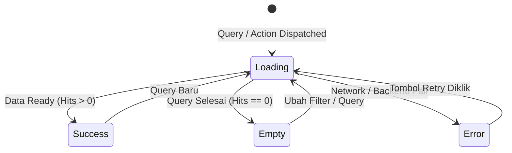

# Design System: LynxSearch

> **Dokumen Referensi:** [PRD-LynxSearch.md](file:///mnt/windows/Users/boyblanco/Documents/code/web/Rust_LynxSearch/PRD-LynxSearch.md) | [ARCHITECTURE.md](file:///mnt/windows/Users/boyblanco/Documents/code/web/Rust_LynxSearch/ARCHITECTURE.md)  
> **Arah Desain:** OpenAI Dark Minimalist + shadcn/ui + Developer Ergonomics  
> **Target Platform:** Desktop Native (Tauri 2.12 + React 19.3 + Tailwind CSS 4.3)

---

## 1. Visi Desain & Filosofi Visual

LynxSearch mengadopsi estetika **OpenAI Dark Minimalist**: presisi geometris, kontras tinggi, latar monokrom pekat (`#000000` & `#0a0a0a`), serta aksen **ChatGPT Teal (`#10a37f`)**. Antarmuka berfokus penuh pada efisiensi developer tanpa ornamen berlebih (no unnecessary gradients, no heavy glassmorphism, no distracting decorations).

### Prinsip Utama (Frontend Design Standard)
1. **Utility-First & Information Density**: Dirancang untuk kecepatan pencarian knowledge base dan kode. Informasi esensial (skor BM25, path, ekstensi, nomor baris) mudah dipindai mata secara instan.
2. **Monochrome Foundation + High Contrast**: Kanvas gelap murni mengurangi kelelahan mata programmer saat membaca ratusan baris dokumen teknis.
3. **Targeted Accent**: Warna hijau teal (`#10a37f`) dipakai eksklusif untuk state aktif, indikator kesehatan sistem, highlight query, dan fokus interaktif utama.
4. **Zero Layout Shifts (CLS = 0)**: Penggunaan skeleton dengan ukuran dan proporsi yang identik dengan kartu hasil pencarian.
5. **Keyboard-First Navigation**: Setiap interaksi kritis dapat dieksekusi tanpa menyentuh mouse.

---

## 2. Token Desain & Tema (Tailwind CSS 4.3 + CSS Variables)

Sistem styling dibangun di atas Tailwind CSS 4.3 menggunakan `@theme` tokens dan CSS Variables terstandarisasi shadcn/ui.

### 2.1 CSS Variables Setup (`apps/desktop/src/index.css`)

```css
@import "tailwindcss";

@layer base {
  :root {
    /* Light Mode Fallback */
    --background: 0 0% 100%;
    --foreground: 0 0% 9%;
    --card: 0 0% 100%;
    --card-foreground: 0 0% 9%;
    --popover: 0 0% 100%;
    --popover-foreground: 0 0% 9%;
    --primary: 161 84% 39%; /* #10a37f OpenAI Teal */
    --primary-foreground: 0 0% 100%;
    --secondary: 0 0% 96.1%;
    --secondary-foreground: 0 0% 9%;
    --muted: 0 0% 96.1%;
    --muted-foreground: 0 0% 45.1%;
    --accent: 161 84% 39%;
    --accent-foreground: 0 0% 100%;
    --destructive: 0 84.2% 60.2%;
    --destructive-foreground: 0 0% 98%;
    --border: 0 0% 89.8%;
    --input: 0 0% 89.8%;
    --ring: 161 84% 39%;
    --radius: 0.5rem;
  }

  .dark {
    /* Dark Mode Default (OpenAI High-Contrast Black) */
    --background: 0 0% 0%; /* #000000 */
    --foreground: 0 0% 98%; /* #fafafa */
    --card: 0 0% 3.9%; /* #0a0a0a */
    --card-foreground: 0 0% 98%;
    --popover: 0 0% 3.9%;
    --popover-foreground: 0 0% 98%;
    --primary: 161 84% 39%; /* #10a37f */
    --primary-foreground: 0 0% 100%;
    --secondary: 0 0% 12%; /* #1f1f1f */
    --secondary-foreground: 0 0% 98%;
    --muted: 0 0% 12%;
    --muted-foreground: 0 0% 63.9%; /* #a3a3a3 */
    --accent: 161 84% 39%;
    --accent-foreground: 0 0% 100%;
    --destructive: 0 62.8% 30.6%;
    --destructive-foreground: 0 0% 98%;
    --border: 0 0% 14.9%; /* #262626 */
    --input: 0 0% 14.9%;
    --ring: 161 84% 39%;
    --radius: 0.5rem;
  }
}

@theme {
  --color-border: hsl(var(--border));
  --color-input: hsl(var(--input));
  --color-ring: hsl(var(--ring));
  --color-background: hsl(var(--background));
  --color-foreground: hsl(var(--foreground));
  --color-primary: hsl(var(--primary));
  --color-primary-foreground: hsl(var(--primary-foreground));
  --color-secondary: hsl(var(--secondary));
  --color-secondary-foreground: hsl(var(--secondary-foreground));
  --color-muted: hsl(var(--muted));
  --color-muted-foreground: hsl(var(--muted-foreground));
  --color-accent: hsl(var(--accent));
  --color-accent-foreground: hsl(var(--accent-foreground));
  --color-destructive: hsl(var(--destructive));
  --color-destructive-foreground: hsl(var(--destructive-foreground));
  --color-card: hsl(var(--card));
  --color-card-foreground: hsl(var(--card-foreground));
  --color-popover: hsl(var(--popover));
  --color-popover-foreground: hsl(var(--popover-foreground));

  --font-sans: 'Inter', -apple-system, BlinkMacSystemFont, 'Segoe UI', Roboto, sans-serif;
  --font-mono: 'JetBrains Mono', 'Fira Code', ui-monospace, monospace;
}
```

### 2.2 Konfigurasi `components.json` (shadcn/ui Registry)

```json
{
  "$schema": "https://ui.shadcn.com/schema.json",
  "style": "default",
  "rsc": false,
  "tsx": true,
  "tailwind": {
    "config": "",
    "css": "src/index.css",
    "baseColor": "zinc",
    "cssVariables": true
  },
  "aliases": {
    "components": "@/components",
    "utils": "@/lib/utils",
    "ui": "@/components/ui",
    "lib": "@/lib",
    "hooks": "@/hooks"
  }
}
```

### 2.3 Class Utility Helper (`apps/desktop/src/lib/utils.ts`)

```typescript
import { type ClassValue, clsx } from 'clsx';
import { twMerge } from 'tailwind-merge';

export function cn(...inputs: ClassValue[]): string {
  return twMerge(clsx(inputs));
}
```

---

## 3. Tipografi & Skala Teks

| Skala | Ukuran | Weight | Line Height | Penggunaan |
|---|---|---|---|---|
| `display` | 2.0rem (32px) | 700 | 1.2 | Headline hero / empty state utama |
| `h1` | 1.5rem (24px) | 600 | 1.3 | Judul dokumen pada panel preview |
| `h2` | 1.25rem (20px) | 600 | 1.4 | Judul modal dialog (Folders, Settings) |
| `h3` | 1.0rem (16px) | 600 | 1.4 | Judul kartu hasil pencarian, judul grup facet |
| `body` | 0.875rem (14px) | 400 | 1.5 | Teks isi dokumen, deskripsi snippet, form label |
| `small` | 0.75rem (12px) | 400 | 1.4 | Path dokumen, metadata timestamp, skor BM25 |
| `code` | 0.8125rem (13px)| 400 | 1.6 | Monospace code viewer, token filter, syntax query |

---

## 4. Arsitektur Tata Letak (3-Pane Workspace)

Aplikasi desktop LynxSearch menggunakan tata letak **3-Pane Split View** profesional:

```text
+-------------------------------------------------------------------------------------------------------+
|  LynxSearch [Drag Region]               [Search Input: Cmd+K / ]           [Status Dot] [Folders] [⚙] |
+-----------------------+-----------------------------------------------+-------------------------------+
| FACETS (260px)        | SEARCH RESULTS (Flex-1)                       | DOCUMENT PREVIEW (Resizable)  |
|                       |                                               |                               |
| [Extension]           | [Total: 42 docs (12ms)]        [Sort: BM25 v] | [Title: auth_service.rs]      |
|  * .rs (24)           +-----------------------------------------------+ [Path: crates/backend/auth.rs]|
|  * .md (12)           | [Card 1: auth_service.rs]         Score: 8.42 |                               |
|  * .ts (6)            |  crates/backend/src/auth_service.rs           | [Actions: Open OS | Copy Path]|
|                       |  Line 42: fn authenticate_user(...)           +-------------------------------+
| [Language]            |  Tag: #auth #backend                          | 41 | pub struct User {        |
|  * Rust (24)          +-----------------------------------------------+ 42 |   pub id: Uuid,          |
|  * Markdown (12)      | [Card 2: Architecture.md]         Score: 5.12 | 43 |   pub email: String,     |
|                       |  docs/Architecture.md                         | 44 | }                        |
| [Type]                |  ...arsitektur otentikasi LynxSearch...       |                               |
|  * Code (30)          +-----------------------------------------------+                               |
|  * Doc (12)           |                                               |                               |
+-----------------------+-----------------------------------------------+-------------------------------+
| Hotkeys: [Cmd+K] Search | [j/k] Navigate | [Enter] Preview | [Cmd+O] Open | [Cmd+Shift+C] Copy Path   |
+-------------------------------------------------------------------------------------------------------+
```

### 4.1 Deskripsi Wilayah (Panes)
1. **Top Application Bar**:
   - `data-tauri-drag-region` untuk drag jendela native.
   - Kotak pencarian global (`Input` terintegrasi dengan filter chips).
   - Indikator Status Kesehatan Backend (Lampu hijau `#10a37f` jika normal, kuning jika indexing, merah jika offline).
   - Tombol Folder Manager & Settings (ikon Lucide).
2. **Left Pane: Sidebar Facet Filters (Lebar Tetap 260px, Collapsible via `[`)**:
   - Menampilkan agregasi facet aktif dari Elasticsearch (`extension`, `language`, `type`, `project`, `tag`).
   - Checkbox interaktif dengan hit count badge. Sinkron dua arah dengan query text input.
3. **Center Pane: Hasil Pencarian (Flex-1, Scrollable)**:
   - Header metrik: Total dokumen cocok, waktu latensi query (ms), dropdown pengurutan (Relevansi BM25, Waktu Modifikasi, Nama File).
   - List kartu hasil pencarian dengan highlight teks dan nomor baris.
4. **Right Pane: Document Preview Panel (Lebar 420px – 640px, Resizable & Collapsible via `]`)**:
   - Header aksi: Tombol "Buka di Editor" (`Cmd+O`), Tombol "Salin Path" (`Cmd+Shift+C`), Tombol Tutup.
   - Rendering dinamis:
     - **Markdown**: Komponen `react-markdown` + GFM dengan style tipografi editorial.
     - **Code**: `VirtualizedCodeViewer` dengan penomoran baris, syntax highlighting Shiki, auto-scroll baris cocok, dan tanda highlight `<mark>`.

---

## 5. Kontrak 4 Micro-States (Frontend Engineering Standard)

Setiap panel dan komponen data wajib mengimplementasikan 4 state secara eksplisit:



### 5.1 Detail Spesifikasi Micro-States

#### 1. Loading State
- Menggunakan komponen `Skeleton` dengan animasi pulse halus (`bg-muted/50 animate-pulse`).
- Layout skeleton identik dengan bentuk kartu hasil pencarian (menghindari CLS).
- Indikator loading spinner Lucide (`Loader2 className="animate-spin text-primary"`) muncul halus pada input pencarian saat debounce aktif.

#### 2. Empty State
- Muncul ketika hasil pencarian `hits == 0` atau belum ada folder yang di-index.
- Konten:
  - Ikon informatif (`SearchX` atau `FolderPlus` dari `lucide-react`).
  - Judul: "Tidak ada dokumen yang cocok".
  - Saran solutif: "Periksa salah ketik kata kunci atau hapus beberapa filter yang terlalu spesifik."
  - Tombol aksi primer: `Button variant="outline"` untuk "Bersihkan Filter" (`Clear Filters`).

#### 3. Error State
- Muncul ketika backend tidak dapat dihubungi (`NetworkError`), Elasticsearch down (`503`), atau query tidak valid.
- Tampilan: Alert card berlatar `bg-destructive/10 border-destructive/30 text-destructive-foreground`.
- Konten: Pesan kesalahan ramah pengguna + kode error domain terstruktur (misal: `ERR_BACKEND_UNAVAILABLE`).
- Tombol aksi: "Coba Lagi" (`Retry`) yang memicu refetch TanStack Query.

#### 4. Success State
- Hasil render data akurat, tag relevansi berwarna aksen, dan highlight kata kunci aktif.

---

## 6. Komponen Spesifik & Implementasi UI

### 6.1 Virtualized Code Viewer (`apps/desktop/src/components/preview/VirtualizedCodeViewer.tsx`)

Komponen performa tinggi untuk merender file source code besar (ribuan baris) tanpa degradasi frame rate (60 FPS):

```typescript
import { useRef, useEffect } from 'react';
import { useVirtualizer } from '@tanstack/react-virtual';
import { cn } from '@/lib/utils';

interface VirtualizedCodeViewerProps {
  lines: string[];
  highlightLine?: number;
  searchTerms?: string[];
}

export function VirtualizedCodeViewer({
  lines,
  highlightLine,
  searchTerms = [],
}: VirtualizedCodeViewerProps) {
  const parentRef = useRef<HTMLDivElement>(null);

  const rowVirtualizer = useVirtualizer({
    count: lines.length,
    getScrollElement: () => parentRef.current,
    estimateSize: () => 22, // 22px baris kode
    overscan: 20,           // Pre-render 20 baris di luar viewport
  });

  // Auto-scroll ke baris kecocokan jika highlightLine tersedia
  useEffect(() => {
    if (highlightLine && highlightLine > 0 && highlightLine <= lines.length) {
      rowVirtualizer.scrollToIndex(highlightLine - 1, {
        align: 'center',
        behavior: 'smooth',
      });
    }
  }, [highlightLine, rowVirtualizer, lines.length]);

  return (
    <div
      ref={parentRef}
      className="h-full w-full overflow-auto bg-black font-mono text-[13px] leading-snug select-text"
      tabIndex={0}
      role="region"
      aria-label="Source code viewer"
    >
      <div
        style={{
          height: `${rowVirtualizer.getTotalSize()}px`,
          width: '100%',
          position: 'relative',
        }}
      >
        {rowVirtualizer.getVirtualItems().map((virtualRow) => {
          const lineNumber = virtualRow.index + 1;
          const isHighlighted = highlightLine === lineNumber;
          const lineContent = lines[virtualRow.index];

          return (
            <div
              key={virtualRow.index}
              data-index={virtualRow.index}
              style={{
                position: 'absolute',
                top: 0,
                left: 0,
                width: '100%',
                height: `${virtualRow.size}px`,
                transform: `translateY(${virtualRow.start}px)`,
              }}
              className={cn(
                'flex items-center px-3 hover:bg-neutral-900/60 transition-colors',
                isHighlighted && 'bg-[#10a37f]/15 border-l-2 border-[#10a37f]'
              )}
            >
              <span className="w-12 shrink-0 pr-4 text-right text-xs text-neutral-500 select-none">
                {lineNumber}
              </span>
              <pre className="font-mono text-neutral-200 overflow-visible whitespace-pre">
                {highlightCodeTokens(lineContent, searchTerms)}
              </pre>
            </div>
          );
        })}
      </div>
    </div>
  );
}

function highlightCodeTokens(text: string, terms: string[]) {
  if (!terms.length || !text) return text;
  const escapedTerms = terms.filter(Boolean).map((t) => t.replace(/[.*+?^${}()|[\]\\]/g, '\\$&'));
  if (!escapedTerms.length) return text;
  
  const regex = new RegExp(`(${escapedTerms.join('|')})`, 'gi');
  return text.split(regex).map((part, i) =>
    regex.test(part) ? (
      <mark key={i} className="bg-[#10a37f]/30 text-[#10a37f] font-semibold rounded px-0.5">
        {part}
      </mark>
    ) : (
      part
    )
  );
}
```

### 6.2 Sistem Notifikasi Toast (`sonner`)

Aplikasi menggunakan `sonner` dengan tema gelap high-contrast:

```typescript
// apps/desktop/src/components/ui/sonner-provider.tsx
import { Toaster as SonnerToaster } from 'sonner';

export function LynxToaster() {
  return (
    <SonnerToaster
      position="bottom-right"
      theme="dark"
      richColors
      closeButton
      toastOptions={{
        className: 'bg-[#0a0a0a] border border-[#262626] text-neutral-100 font-sans shadow-2xl',
      }}
    />
  );
}
```

**Katalog Trigger Notifikasi**:
- Berhasil salin path ke clipboard: `toast.success("Path file disalin ke clipboard")`
- Pemindaian folder dimulai: `toast.info("Memulai pemindaian folder...")`
- Pengaturan disimpan: `toast.success("Pengaturan berhasil disimpan")`
- Job dibatalkan: `toast.warning("Indexing dibatalkan oleh pengguna")`
- Gagal terhubung ke backend: `toast.error("Gagal terhubung ke service backend")`

### 6.3 Localized Date & Relative Time (`apps/desktop/src/lib/date.ts`)

Menggunakan API browser native `Intl` (zero additional bundle size):

```typescript
export function formatDateTime(dateStr: string | null | undefined): string {
  if (!dateStr) return '-';
  return new Intl.DateTimeFormat(undefined, {
    dateStyle: 'medium',
    timeStyle: 'short',
  }).format(new Date(dateStr));
}

export function formatRelativeTime(dateStr: string | null | undefined): string {
  if (!dateStr) return '-';
  const deltaSeconds = Math.round((new Date(dateStr).getTime() - Date.now()) / 1000);
  const cutoffs = [60, 3600, 86400, 86400 * 7, 86400 * 30, Infinity];
  const units: Intl.RelativeTimeFormatUnit[] = ['second', 'minute', 'hour', 'day', 'week', 'month'];
  const unitIndex = cutoffs.findIndex((cutoff) => cutoff > Math.abs(deltaSeconds));
  const divisor = unitIndex > 0 ? cutoffs[unitIndex - 1] : 1;
  const rtf = new Intl.RelativeTimeFormat(undefined, { numeric: 'auto' });
  return rtf.format(Math.round(deltaSeconds / divisor), units[unitIndex]);
}
```

---

## 7. Modal Dialogs & Overlay Views

Untuk menjaga alur pencarian tidak terputus, fitur manajemen dan pengaturan disajikan dalam bentuk **Modal Dialog Overlay** (Radix UI Dialog):

### 7.1 Folder Manager Dialog (`FolderManagerModal.tsx`)
- **Fungsi**: Mendaftarkan folder baru, melihat status folder yang terdaftar, memicu Re-scan, menghapus folder dari index, dan memicu Rebuild Index.
- **Elemen UI**:
  - Tombol primer: `+ Tambah Folder` (memanggil `@tauri-apps/plugin-dialog` native directory picker).
  - Tabel Folder: Path root, Waktu scan terakhir (`formatRelativeTime`), Jumlah dokumen ter-index, Badge status (`IDLE`, `SCANNING`, `ERROR`).
  - Action per folder: Tombol `Re-scan` (idempoten), Tombol `Hapus` (dengan konfirmasi dialog).
  - Tombol bahaya: `Rebuild Index` (dialog konfirmasi bertingkat sebelum menghapus dan membangun ulang index Elasticsearch).

### 7.2 Settings Dialog (`SettingsModal.tsx`)
- **Fungsi**: Konfigurasi parameter pencarian dan batas file.
- **Form Controls**:
  - `Max File Size (MB)`: Input numerik (default: 2MB).
  - `Ignore Patterns`: Tag-input list (default: `.git`, `node_modules`, `target`, `dist`, `build`).
  - `BM25 Field Weights`: 3 slider interaktif (`@radix-ui/react-slider`):
    - Bobot Judul (`Title Weight`, default: 3.0)
    - Bobot Tag (`Tag Weight`, default: 2.0)
    - Bobot Isi (`Content Weight`, default: 1.0)
  - Tombol "Reset to Default" dan "Simpan Pengaturan".

### 7.3 Index Job Progress Banner / Drawer
- Ditampilkan saat terdapat background job aktif (`job.status === 'RUNNING'`).
- Menampilkan:
  - Progress bar dinamis (`value = (processed / total) * 100`).
  - Metrik: `Processed`, `Skipped`, `Failed`.
  - Tombol `Batalkan Job` (`CancelJobButton`) yang memanggil `/api/index/jobs/:id/cancel`.

---

## 8. Navigasi Keyboard & Aksesibilitas (WCAG 2.2 AA)

LynxSearch mengutamakan alur kerja developer berbasis keyboard secara menyeluruh:

### 8.1 Peta Pintasan Keyboard (Shortcuts Map)

| Shortcut | Aksi | Konteks |
|---|---|---|
| `Cmd/Ctrl + K` atau `/` | Fokus ke input search box global | Di mana saja |
| `Escape` | Bersihkan input / Tutup modal / Tutup preview panel | Di mana saja |
| `ArrowDown` / `j` | Pindah seleksi ke hasil pencarian berikutnya | Daftar hasil |
| `ArrowUp` / `k` | Pindah seleksi ke hasil pencarian sebelumnya | Daftar hasil |
| `Enter` | Buka dokumen terpilih di panel preview | Daftar hasil |
| `Cmd/Ctrl + O` | Buka file asli di IDE / Editor default OS via Tauri Shell | Preview aktif |
| `Cmd/Ctrl + Shift + C` | Salin absolute path file ke OS clipboard | Hasil / Preview |
| `[` | Toggle collapse sidebar facet filter | Di mana saja |
| `]` | Toggle collapse preview panel | Di mana saja |

### 8.2 Standar Aksesibilitas
- **Rasio Kontras**: Teks normal memenuhi rasio kontras minimal 4.5:1 terhadap background `#000000` / `#0a0a0a`. Teks kode dan aksen memenuhi minimal 3:1.
- **Focus Rings Visible**: Seluruh elemen interaktif memiliki outline ring fokus yang tegas (`focus-visible:ring-2 focus-visible:ring-primary focus-visible:outline-none`).
- **Screen Reader Support**: Seluruh button ikonik memiliki atribut `aria-label` eksplisit (misal: `aria-label="Tutup panel preview"`).
- **Reduced Motion**: Mendukung media query `@media (prefers-reduced-motion: reduce)` dengan menonaktifkan animasi pulse dan transisi CSS.
